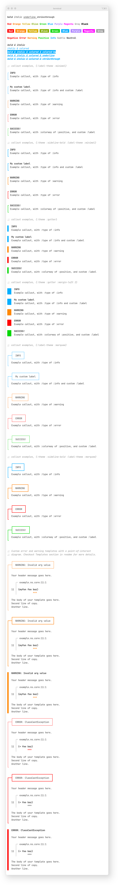
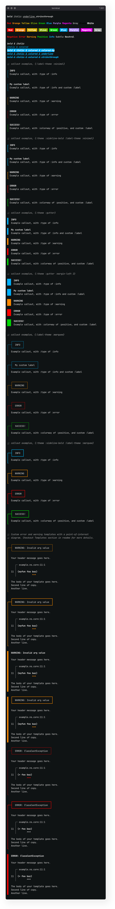

<!-- TODO - Update images with new colors -->
# bling

**Rich text in the console.**  


<p align="left">
  <a href="https://clojars.org/io.github.paintparty/bling">
    </img>
  </a>
</p>

<div align="left">

**[Features]**  &nbsp;•&nbsp; **[Setup]**  &nbsp;•&nbsp;  **[Basic Usage]** &nbsp;•&nbsp; **[Callout Blocks]** &nbsp;•&nbsp; **[Error Templates]**
</div>

[Features]: #features
[Setup]: #setup
[Basic Usage]: #basic-usage
[Callout Blocks]: #callout-blocks

[Error Templates]: #templates-for-errors-and-warnings
[Interop]: #printing-conventions
[Contributing]: #contributing

<br>
<br>

<p align="left">
  
</p>

The same example as above, in a terminal emulator with a dark background.
<p align="left">
  
</p>

## Features

- Works great for Clojure, ClojureScript, and Babashka.

- Supports both terminal emulators and browser consoles.

- Simple, accessibility-focused, 11-color pallette.

- All colors provide reasonable contrast on both light and dark backgrounds.

- Simple and intuitive hiccup-like markup syntax.

- Sensible templates for warning and error callouts.


<br>

## Setup


Add as a dependency to your project:


```Clojure
[io.github.paintparty/bling "0.5.0"]
```
<br>

Require:

```Clojure
(require '[bling.core :refer [bling callout point-of-interest]])

;; In ClojureScript, you may also want :refer bling.core/print-bling.
```

<br>

Or, import into your namespace:

```Clojure
(ns myns.core
  (:require
    [bling.core :refer [bling callout point-of-interest]]))

;; In ClojureScript, you may also want :refer bling.core/print-bling.
```

<br>

You can view an exhaustive sampling of Bling output by pasting this snippet into your terminal:

```clojure
clj -Sdeps '{:deps {io.github.paintparty/bling {:mvn/version "0.5.2"}}}' -e "(require '[bling.sample]) (println (bling.sample/sample))"
```
<br>
<br>

To view the above sample with Babashka, paste this snippet into your terminal:

```clojure
bb -Sdeps '{:deps {io.github.paintparty/bling {:mvn/version "0.5.2"}}}' -e "(require '[bling.sample]) (println (bling.sample/sample))"
```

<br>
<br>


## Basic Usage 

> [!NOTE]
> If you are reading this on github in a light-mode theme, the dark-mode samples in the sections below will appear to have lower contrast than they actually do if you were viewing them in dark-mode. 

<br>

**`bling.core/bling`** takes any number of arguments and returns a string
of text decorated with tags for colorization, italics, and boldness:

```Clojure
(println (bling [:bold "bold"]
                ", "
                [:italic "italic"]
                ", or "
                [:blue "colored"]))
```
<p align="center">
  
</p>

</p>

<p align="center"></p>


<br>

In ClojureScript (browser context), **`bling`** returns a js object that needs to be printed like this: <br>
`(.apply js/console.log js/console (goog.object/get o "consoleArray"))`.<br>

To avoid typing all this out, you can use **`bling.core/print-bling`** to print the array returned from **`bling`**:

```Clojure
(print-bling (bling [:bold "bold"]
                    ", "
                    [:italic "italic"]
                    ", or "
                    [:blue "colored"]))
```

By default **`bling.core/print-bling`** prints with `js/console.log`.
If you would like to print with either `js.console/warn`, or `js/console.error`, you can pass either as a second argument.

```Clojure
(print-bling (bling [:bold "bold"]
                    ", "
                    [:italic "italic"]
                    ", or "
                    [:blue "colored"])
             js/console.warn)
```
<br>

### Combo styles

You can add multiple decorations with hiccup-style tags (a keyword with dot separators). The order of the things separated by dots doesn't matter.
```Clojure
(println (bling [:bold.italic "bold & italic"]
                ", "
                [:italic.blue "italic & colored"]
                ", "
                [:bold.italic.white.blue-bg
                 "bold & italic & colored & colored-bg"]
                ", "
                [:bold.italic.blue.underline
                 "bold & italic & colored & underline"]
                ", "
                [:bold.italic.blue.strikethrough
                 "bold & italic & colored & strikethrough"]))
```
<p align="center"></p>
<p align="center"></p>

<br>


You can also pass a map (instead of a hiccup-style keyword tag) to style the text:

```Clojure
(bling [{:color            :green
         :background-color :black
         :font-style       :italic
         :font-weight      :bold}
        "bold italic green text on black background"])
```
Using a map is preferrable if you are doing something like this:
```Clojure
(println (string/join (for [c ["red"
                               "orange"
                               "yellow"
                               "olive"
                               "green"
                               "blue"
                               "purple"
                               "magenta"]]
                        (bling [{:background-color c
                                 :color            :white
                                 :font-weight      :bold}
                                (str " " c " ")]))))
```

<br>

Note that all the arguments to **`bling.core/bling`** must satisfy this predicate:

```Clojure
(every? (fn [x]
          (or (and (vector? x)
                   (= 2 (count x))
                   (-> x
                       (nth 0)
                       (maybe #(or (keyword? %)
                                   (map? %)))))
              (not (coll? x))))
        args)
```

In other words, every one of the arguments to **`bling.core/bling`** must be either:<br>

- A two-element vector, with the first element being a keyword or map.<br>
- A value which is not a collection.

If, for example, you wanted to print `[1 2 3]` in red, you will need to stringify the vector:

```Clojure
(bling [:red (str [1 2 3])])
```


### The Bling pallette 

Eleven carefully selected colors, from the [xterm range 16-255](https://en.m.wikipedia.org/wiki/Xterm#/media/File%3AXterm_256color_chart.svg), are available for use. All of these colors should display consistantly across most consoles on the end-user side. Don't expect all of the colors to pass the [strictest APCA contrast criterion](https://www.myndex.com/APCA/), but you can be sure of reasonable visibility on both light and dark backgrounds:

```Clojure
(println (bling [:bold.red "Red"]
                ", "
                [:bold.orange "Orange"]
                ", "
                [:bold.yellow "Yellow"]
                ", "
                [:bold.green "Olive"]
                ", "
                [:bold.green "Green"]
                ", "
                [:bold.blue "Blue"]
                ", "
                [:bold.blue "Purple"]
                ", "
                [:bold.magenta "Magenta"]
                ", "
                [:bold.gray "Gray"]
                ", "
                [:bold.black "Black"]
                ", "
                [:bold.white "White"] ))
```
<p align="center"></p>
<p align="center"></p>

<br>

### Color aliases

You can use the following semantic aliases for some colors:
```Clojure
(println (bling [:bold.negative "Negative"]
                ", "
                [:bold.error "Error"]
                ", "
                [:bold.warning "Warning"]
                ", "
                [:bold.positive "Positive"]
                ", "
                [:bold.info "Info"]
                ", "
                [:bold.subtle "Subtle"]
                ", "
                [:bold.neutral "Neutral"]))
```
<br>

<p align="center"></p>
<p align="center"></p>

<br>

### Using system colors

Bling also supports named color aliases for system colors (Xterm colors 0-16).

Most likely, you do **not** want to use these. They will not display consistently across user spaces, as the actual color is dictated by the theme the user has selected in their particular terminal emulator.

If, however, you are using Bling to provide errors, warnings, and messages for that only you will ever see (on your own computer), and your terminal emulator theme is totally dialed-in to your liking, then system colors might be an option worth exploring.


```Clojure
(println (bling [:system-black "black (SYSTEM)"]))
(println (bling [:system-maroon "maroon (SYSTEM)"]))
(println (bling [:system-green "green (SYSTEM)"]))
(println (bling [:system-olive "olive (SYSTEM)"]))
(println (bling [:system-navy "navy (SYSTEM)"]))
(println (bling [:system-purple "purple (SYSTEM)"]))
(println (bling [:system-teal "teal (SYSTEM)"]))
(println (bling [:system-silver "silver (SYSTEM)"]))
(println (bling [:system-grey "grey (SYSTEM)"]))
(println (bling [:system-red "red (SYSTEM)"]))
(println (bling [:system-lime "lime (SYSTEM)"]))
(println (bling [:system-yellow "yellow (SYSTEM)"]))
(println (bling [:system-blue "blue (SYSTEM)"]))
(println (bling [:system-fuchsia "fuchsia (SYSTEM)"]))
(println (bling [:system-aqua "aqua (SYSTEM)"]))
(println (bling [:system-white "white (SYSTEM)"]))
```
<br>

### Using arbitrary colors

Bling also supports arbitrary colors in the xTerm 0-256 range. If you are using
arbitrary colors to construct messages to stdout that other people might have to
read, you may want to test the appearance with both light and dark terminal
themes. They must be provided as integers, so you will need to use an options
map instead of a hiccup-style keyword:

```Clojure
(println (bling [{:color 180} "xTerm color 180, aka Tan"]))
```

<br>

<br>

## Callout blocks
**`bling.core/callout`** will print a message "block" to the console with a colored bounding border in the inline-start position.

**`callout`** takes one or two arguments. If two arguments are supplied, the first should be a map with 0 or more of following entries:

| Key               | Pred                    | Description                                                  |
| :---------------  | -----------------       | ------------------------------------------------------------ |
| `:type`           | #{`keyword?` `string?`} | Should be one of: `:error`,  `:warning` , or `:info`. <br>Will set the label text (unless provided via `:label`). Will also set the `:colorway`, and override any provided `:colorway` value. |
| `:colorway`       | #{`keyword?` `string?`} | The color of the sideline border, or gutter, depending on the value of `:theme`.<br />Should be one of: `:error`,  `:warning` , `:info` , `:positive`, or `:subtle`. <br>Can also be any one of the pallete colors such as  `:magenta`, `:green`,  `:negative`, `:neutral`, etc. |
| `:theme`          | #{`keyword?` `string?`} | Theme of callout. Can be one of `:sideline`, `:sideline-bold`, or `:gutter`. Defaults to `:sideline`. |
| `:label`          | `any?`                  | Labels the callout. In a terminal emulator context, the value will be cast to a string. In a browser context, the label can be an instance of `bling.core/Enriched`, or any other value (which will be cast to a string). <br>In the case of a callout `:type` of `:warning`, `:error`, or `:info`, the value of the label will default to `WARNING`, `ERROR`, or `INFO`, respectively. |
| `:label-theme`    | #{`keyword?` `string?`} | Theme of label. Can be one of `:marquee` or `:minimal`. Defaults to `:minimal`. |
| `:padding-top`    | `int?`                  | Amount of padding (in newlines) at top, inside callout.<br/>Defaults to `0`. |
| `:padding-bottom` | `int?`                  | Amount of padding (in newlines) at bottom, inside callout.<br>Defaults to `0`. In browser console, defaults to `1` in the case of callouts of type `:warning` or `:error`.|
| `:padding-left`   | `int?`                  | Amount of padding (in blank character spaces) at left, inside callout.<br>In console emulator, defaults to `2`. In browser console, defaults to `0`.|
| `:margin-top`     | `int?`                  | Amount of margin (in newlines) at top, outside callout.<br>Defaults to `1`. Only applies to terminal emulator printing. |
| `:margin-bottom`  | `int?`                  | Amount of margin (in newlines) at bottom, outside callout.<br>Defaults to `0`. Only applies to terminal emulator printing. |
| `:margin-left`    | `int?`                  | Amount of margin (in blank character spaces) at left, outside callout.<br>Defaults to `0`. Only applies to terminal emulator printing. |
| `:data?`          | `boolean?`              | Returns a data representation of result instead of printing it. |


<br>
<br>

Examples of `callout` with different `:type` / `:colorway` options:

```Clojure
(callout {:type :info}
         "Example callout, with :type of :info")

(callout {:type  :info
          :label "My custom label"}
         "Example callout, with :type of :info and custom :label")

(callout {:type :warning}
         "Example callout, with :type of :warning")

(callout {:type :error}
         "Example callout, with :type of :error")

(callout {:type  :positive
          :label "SUCCESS!"}
         "Example callout, with :type of :positive, and custom :label")

(callout {:type :subtle}
         "Example callout, with :type of :subtle (or :gray)")

(callout {:type :magenta}
         "Example callout, with :type of :magenta")

(callout "Example callout, default")
```

<br>

The above calls would render the following in your terminal emulator: 
<p align="center"></p>
<p align="center"></p>
<br>

With `{:theme :sideline-bold}`: 
<p align="center"></p>
<p align="center"></p>
<br>

Callout accepts a `:label-theme` option. Supplying a value of `:marquee`, will render
the label inside a box: 

<p align="center"></p>
<p align="center"></p>
<br>

With `{:theme :sideline-bold :label-theme :marquee}`: 
<p align="center"></p>
<p align="center"></p>
<br>


<br>

## Templates for errors and warnings

**`bling.core/callout`**, paired with **`bling.core/point-of-interest`** 
is perfect for creating your own custom error or warning messages. 


Here is an example of creating a custom callout for an error message.
You must provide the relevant `:file`, `:line`, `:column`, and `:form` values.

```Clojure
(defn example-custom-callout
  [{:keys [point-of-interest-opts callout-opts]}]
  (let [poi-opts     (merge {:header "Your header message goes here."
                             :body   (str "The body of your message goes here."
                                          "\n"
                                          "Another line of copy."
                                          "\n"
                                          "Another line."
                                          )}
                            point-of-interest-opts)
        message      (point-of-interest poi-opts)
        callout-opts (merge callout-opts
                            {:padding-top 1})]
    (callout callout-opts message)))

(example-custom-callout
 {:point-of-interest-opts {:type                  :error
                           :file                  "example.ns.core"
                           :line                  11
                           :column                1
                           :form                  '(+ foo baz)
                           :text-decoration-index 2}
  :callout-opts           {:type :error}})
```


<br>

The above callout would render like this your terminal emulator: 

<p align="center"></p>
<p align="center"></p>

You can also render such warning and error callouts using a `:label-theme` value of `:marquee`. 

<p align="center"></p>
<p align="center"></p>

The diagram inside the callout that shows the namespace, line, column, and form
with underlined is created by **`bling.core/point-of-interest`**, which takes a
single map with the following options:

<br>


| Key                | Pred                   | Description                                                  |
| :--------          | -----------------      | ------------------------------------------------------------ |
| `:file`            | `string?`              | File or namespace                                            |
| `:line`            | `integer?`             | Line number                                                  |
| `:column`          | `integer?`             | Column number                                                |
| `:form`            | `any?`                 | The form to draw attention to. Will be cast to string and truncated at 33 chars |
| `:header`          | `any?`                 | Typically, a string. If multi-line, string should be composed with newlines as desired. In a browser context, can be an instance of `bling.core/Enriched` (produced by using `bling.core/enriched`)|
| `:body`            | `any?`                 | Typically, a string. If multi-line, string should be composed with newlines as desired. In a browser context, can be an instance of `bling.core/Enriched` (produced by using `bling.core/enriched`)|
| `:margin-block`    | `int?`                 | Controls the number of blank lines above and below the diagram.<br/>Defaults to `1`.|
| `:type`            | #{`:error` `:warning`} | Automatically sets the `:text-decoration-color`. |
| `:text-decoration-color` | #{`keyword?` `string?`} | Controls the color of the underline. Should be one of: `:error` `:warning`, or `:neutral`.<br>Can also be any one of the pallete colors such as  `:magenta`, `:green`,  `:negative`, `:neutral`, etc. Defaults to `:neutral` |
| `:text-decoration-style` | #{`:wavy` `:solid` `:dashed` `:dotted` `:double`} | Controls the color of the underline. |
| `:text-decoration-index` | `pos-int?` | If the value of `:form` is a collection, this is the index of the item to apply text-decoration (underline). |
<br>
<br>

## Go heavy

If you want to place more emphasis on your callouts you can pass
**`bling.core/callout`** a `:theme` option with a value of `:gutter`. With the
`:gutter` theme, the thickness of the colored border is controlled by the value of
`:margin-left`. Here is an example using the `example-custom-callout` function we
defined above:

```Clojure
(example-custom-callout
 {:file          "example.ns.core"
  :line          11
  :column        1
  :form          '(+ 1 true)
  :type          :error
  :theme         :gutter})
```

<p align="center"></p>
<p align="center"></p>

Example value of `2` for `:margin-left`, to increase the weight:

```Clojure
(example-custom-callout
 {:file          "example.ns.core"
  :line          11
  :column        1
  :form          '(+ 1 true)
  :type          :error
  :margin-left   2
  :theme         :gutter})
```
<p align="center"></p>
<p align="center"></p>

More callout examples of the `:gutter` theme:

<p align="center"></p>
<p align="center"></p>


More example values of `2` for `:margin-left`, to increase the weight:

<p align="center"></p>
<p align="center"></p>


<br>

## Testing
There is a set of visual test suites in `bling.core-test`.

For visual testing of output in node / deno context first do:

`shadow-cljs compile node-script`

Then do 

`node out/bling-in-node-demo-script.js`

<br>

## Status / Roadmap
Alpha, subject to change. Issues welcome, see [contributing](#contributing).

<br>

## Contributing
Issues for bugs, improvements, or features are very welcome. Please file an
issue for discussion before starting or issuing a PR.


<br>

<!-- ## Alternatives / Prior Art -->

<br>          
