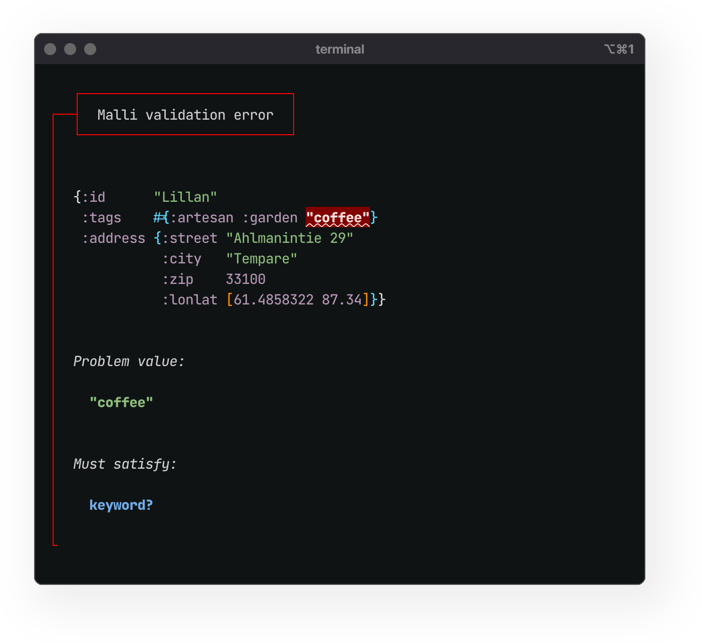
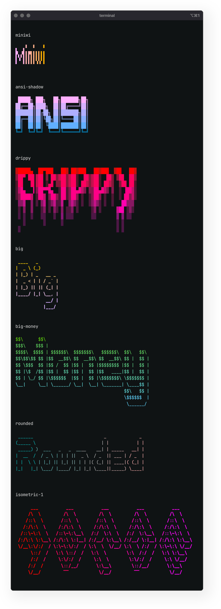

<p><sub>Many thank to <a href="https://www.clojuriststogether.org/">Clojurists Together</a> for generously supporting this project!</sub></p>

<!-- TODO - Update images with new colors -->
# Bling

**Rich text in the console.**  


<p align="left">
  <a href="https://clojars.org/io.github.paintparty/bling">
    </img>
  </a>
</p>

<div align="left">

**[Features]**
&nbsp;•&nbsp;
**[Setup]**
&nbsp;•&nbsp;
**[Basic Usage]**
&nbsp;•&nbsp;
**[Colors]**
&nbsp;•&nbsp;
**[Callout Blocks]**
<br>
**[Error Templates]**
&nbsp;•&nbsp; 
**[Hifi]**
&nbsp;•&nbsp; 
**[Malli]**
&nbsp;•&nbsp; 
**[Banners]**
&nbsp;•&nbsp; 
**[Dev]**
&nbsp;•&nbsp; 
**[Contributing]**
</div>

[Features]: #features
[Setup]: #setup
[Basic Usage]: #basic-usage
[Colors]: #the-bling-palette
[Callout Blocks]: #callout-blocks
[Error Templates]: #templates-for-errors-and-warnings
[Hifi]: #high-fidelity-printing
[Malli]: #usage-with-malli
[Banners]: #figlet-banners
[Dev]: #development
[Contributing]: #contributing

<br>
<br>


<p align="left">
  
</p>

The same example as above, in a terminal emulator with a light background.
<p align="left">
  
</p>

## Features

- Works great for Clojure, ClojureScript, and Babashka.

- Supports both terminal emulators and browser consoles.

- Simple, accessibility-focused, 11-color palette.

- All colors provide reasonable contrast on both light and dark backgrounds.

- Simple and intuitive hiccup-like markup syntax.

- Sensible templates for warning and error callouts.


<br>

## Setup


Add as a dependency to your project:


lein:
```Clojure
[io.github.paintparty/bling "0.8.7"]
```

deps:
```Clojure
io.github.paintparty/bling {:mvn/version "0.8.7"}
```
<br>

Require:

```Clojure
(require '[bling.core :refer [bling print-bling callout point-of-interest]])
```

<br>

Or, import into your namespace:

```Clojure
(ns myns.core
  (:require
    [bling.core :refer [bling print-bling callout point-of-interest]]))
```

<br>

You can view an exhaustive sampling of Bling output by pasting this snippet into your terminal:

```clojure
clj -Sdeps '{:deps {io.github.paintparty/bling {:mvn/version "0.8.7"}}}' -e "(require '[bling.sample]) (println (bling.sample/sample))"
```
<br>

To view the above sample with Babashka, paste this snippet into your terminal:

```clojure
bb -Sdeps '{:deps {io.github.paintparty/bling {:mvn/version "0.8.7"}}}' -e "(require '[bling.sample]) (println (bling.sample/sample))"
```
<br>

### Enhanced contrast
You can optionally set a `BLING_MOOD` environmental variable on your system, which will enhance the contrast of bling output on your computer.

If you use a dark terminal theme:
```
export BLING_MOOD="dark"
```

If you use a light terminal theme:
```
export BLING_MOOD="light"
```

<br>
<br>


## Basic Usage 

> [!NOTE]
> If you are reading this on github in a light-mode theme, the dark-mode samples in the sections below will appear to have lower contrast than they actually do if you were viewing them in dark-mode. 

<br>

**`bling.core/print-bling`** takes any number of arguments and prints to the
console with colorization, italics, boldness, and text-decoration:

```Clojure
(print-bling [:bold "bold"]
             ", "
             [:italic "italic"]
             ", or "
             [:blue "colored"])
```


<p align="center">
  
</p>

</p>

<p align="center"></p>

**`bling.core/print-bling`** returns `nil`.

<br>

If you just want a string (no printing), **`bling.core/bling`** works exactly
like **`bling.core/print-bling`** but does not print. Instead it returns a
string of text decorated with the appropriate ANSI SGR tags:
```Clojure
(bling [:bold.red "hello"]) ;; => "\033[38;5;203;1mhello\033[0;m"
```

In ClojureScript (browser context), **`bling`** returns a js object that
`print-bling` uses to construct a call to `js/console.log` which results in the
text decorated as expected in a browser dev console.<br>


<br>

### Combo styles

You can add multiple decorations with hiccup-style tags (a keyword with dot separators). The order of the things separated by dots doesn't matter.
```Clojure
(print-bling [:bold.italic "bold & italic"]
             ", "
             [:italic.blue "italic & colored"]
             ", "
             [:bold.italic.white.blue-bg
             "bold & italic & colored & colored-bg"]
             ", "
             [:bold.italic.blue.underline
             "bold & italic & colored & underline"]
             ", "
             [:bold.italic.blue.strikethrough
             "bold & italic & colored & strikethrough"])
```
<p align="center"></p>
<p align="center"></p>

<br>

#### Using a map instead of a hiccup-style keyword
You can also pass a map (instead of a hiccup-style keyword tag) to style the text:

```Clojure
(print-bling [{:color            :green
               :background-color :black
               :font-style       :italic
               :font-weight      :bold}
               "bold italic green text on black background"])
```
Using a map is preferrable if you are doing something like this:
```Clojure
(println (string/join (for [c ["red"
                               "orange"
                               "yellow"
                               "olive"
                               "green"
                               "blue"
                               "purple"
                               "magenta"]]
                        (bling [{:background-color c
                                 :color            :white
                                 :font-weight      :bold}
                                (str " " c " ")]))))
```

<br>


### Underline styles

```Clojure
(print-bling [:underline "underline"]
              "\n"
              [:solid-underline "solid-underline"]
              "\n"
              [:double-underline "double-underline"]
              "\n"
              [:wavy-underline "wavy-underline"]
              "\n"
              [:dotted-underline "dotted-underline"]
              "\n"
              [:dashed-underline "dashed-underline"])
```
<p align="center"></p>
<p align="center"></p>

<br>


### Hyperlinks

Bling supports clickable hyperlinks in terminal environments. You must use `cmd` + click to navigate to the link.

```Clojure
(print-bling [{:href "http://example.com"}
              "cmd + click to follow this hyperlink"])
```
<p align="center"></p>
<p align="center"></p>


#### Hyperlink support in browser dev consoles
Hyperlink support in browser dev consoles is actually more limited.
This is not a limitation of Bling but rather the browser.

```Clojure
(print-bling [{:href "http://example.com"}
              "My site"])
```
In a browser dev console, Bling would format the above example above like this:<br>
<code>My site <ins>http://example.com</ins></code>

If you just want a clickable link in a browser dev environment, you don't
necessarily need to use Bling's `:href` feature, as a valid url will be automatically
clickable and styled by the browser dev console.


<br>


#### Valid arguments to bling
Note that all the arguments to **`bling.core/print-bling`** and
**`bling.core/bling`** must satisfy this predicate:

```Clojure
(every? (fn [x]
          (or (and (vector? x)
                   (= 2 (count x))
                   (-> x
                       (nth 0)
                       (maybe #(or (keyword? %)
                                   (map? %)))))
              (not (coll? x))))
        args)
```

In other words, every one of the arguments to **`bling.core/print-bling`**
and **`bling.core/bling`** must be either:<br>

- A two-element vector, with the first element being a keyword or map.<br>
- A value which is not a collection.

If, for example, you wanted to print `[1 2 3]` in red, you will need to stringify the vector:

```Clojure
(print-bling [:red (str [1 2 3])])
```


<br>
<br>

## The Bling palette 

Eleven carefully selected colors, from the [8-bit(256 colors)](https://en.m.wikipedia.org/wiki/Xterm#/media/File%3AXterm_256color_chart.svg), range(16-255) are available for use. All of these colors should display consistantly across most consoles on the end-user side. Don't expect all of the colors to pass the [strictest APCA contrast criterion](https://www.myndex.com/APCA/), but you can be sure of reasonable visibility on both light and dark backgrounds:

```Clojure
(print-bling [:bold.red "Red"]
             ", "
             [:bold.orange "Orange"]
             ", "
             [:bold.yellow "Yellow"]
             ", "
             [:bold.green "Olive"]
             ", "
             [:bold.green "Green"]
             ", "
             [:bold.blue "Blue"]
             ", "
             [:bold.blue "Purple"]
             ", "
             [:bold.magenta "Magenta"]
             ", "
             [:bold.gray "Gray"]
             ", "
             [:bold.black "Black"]
             ", "
             [:bold.white "White"])
```
<p align="center"></p>
<p align="center"></p>

> [!NOTE]
You can further optimize the contrast of the above palette, for your eyes only, by setting a `BLING_MOOD` env var as described [here](https://github.com/paintparty/bling?tab=readme-ov-file#enhanced-contrast).

<br>
<br>

### Color aliases

You can use the following semantic aliases for some colors:
```Clojure
(print-bling [:bold.negative "Negative"]
             ", "
             [:bold.error "Error"]
             ", "
             [:bold.warning "Warning"]
             ", "
             [:bold.positive "Positive"]
             ", "
             [:bold.info "Info"]
             ", "
             [:bold.subtle "Subtle"]
             ", "
             [:bold.neutral "Neutral"])
```
<br>

<p align="center"></p>
<p align="center"></p>

<br>

### Using system colors

Bling also supports named color aliases for system colors (16 colors).

Most likely, you do **not** want to use these. They will not display consistently across user spaces, as the actual color is dictated by the theme the user has selected in their particular terminal emulator.

If, however, you are using Bling to provide errors, warnings, and messages for that only you will ever see (on your own computer), and your terminal emulator theme is totally dialed-in to your liking, then system colors might be an option worth exploring.


```Clojure
(print-bling [:system-black "black (SYSTEM)"])
(print-bling [:system-maroon "maroon (SYSTEM)"])
(print-bling [:system-green "green (SYSTEM)"])
(print-bling [:system-olive "olive (SYSTEM)"])
(print-bling [:system-navy "navy (SYSTEM)"])
(print-bling [:system-purple "purple (SYSTEM)"])
(print-bling [:system-teal "teal (SYSTEM)"])
(print-bling [:system-silver "silver (SYSTEM)"])
(print-bling [:system-grey "grey (SYSTEM)"])
(print-bling [:system-red "red (SYSTEM)"])
(print-bling [:system-lime "lime (SYSTEM)"])
(print-bling [:system-yellow "yellow (SYSTEM)"])
(print-bling [:system-blue "blue (SYSTEM)"])
(print-bling [:system-fuchsia "fuchsia (SYSTEM)"])
(print-bling [:system-aqua "aqua (SYSTEM)"])
(print-bling [:system-white "white (SYSTEM)"])
```
<br>

### Using arbitrary colors

Bling also supports arbitrary colors in the 8-bit(256 colors range). If you are using
arbitrary colors to construct messages to stdout that other people might have to
read, you may want to test the appearance with both light and dark terminal
themes. They must be provided as integers, so you will need to use an options
map instead of a hiccup-style keyword:

```Clojure
(print-bling [{:color 180} "8-bit color 180, aka Tan"])
```

<br>

<br>

## Callout blocks
**`bling.core/callout`** will print a message "block" to the console with a colored bounding border in the inline-start position.

**`callout`** takes any number arguments. The first can optionally be a map with 0 or more of following entries:

| Key               | Pred                    | Description                                                  |
| :---------------  | -----------------       | ------------------------------------------------------------ |
| `:type`           | #{`keyword?` `string?`} | Should be one of: `:error`,  `:warning` , or `:info`. <br>Will set the label text (unless provided via `:label`). Will also set the `:colorway`, and override any provided `:colorway` value. |
| `:colorway`       | #{`keyword?` `string?`} | The color of the sideline border, or gutter, depending on the value of `:theme`.<br />Should be one of: `:error`,  `:warning` , `:info` , `:positive`, or `:subtle`. <br>Can also be any one of the pallete colors such as  `:magenta`, `:green`,  `:negative`, `:neutral`, etc. |
| `:theme`          | #{`keyword?` `string?`} | Theme of callout. Can be one of `:sideline`, `:sideline-bold`, `:minimal`, or `:gutter`. Defaults to `:sideline`. |
| `:label`          | `any?`                  | Labels the callout. In a terminal emulator context, the value will be cast to a string. In a browser context, the label can be an instance of `bling.core/Enriched`, or any other value (which will be cast to a string). <br>In the case of a callout `:type` of `:warning`, `:error`, or `:info`, the value of the label will default to `WARNING`, `ERROR`, or `INFO`, respectively. |
| `:side-label`     | `any?`                  | Side label to the the callout label. In a terminal emulator context, the value will be cast to a string. In a browser context, the label can be an instance of `bling.core/Enriched`, or any other value (which will be cast to a string). <br>In the case of a callout `:type` of `:warning`, `:error`, or `:info`, the value of the label will default to `WARNING`, `ERROR`, or `INFO`, respectively. |
| `:label-theme`    | #{`keyword?` `string?`} | Theme of label. Can be one of `:marquee` or `:minimal`. Defaults to `:minimal`. |
| `:padding-top`    | `int?`                  | Amount of padding (in newlines) at top, inside callout.<br/>Defaults to `0`. |
| `:padding-bottom` | `int?`                  | Amount of padding (in newlines) at bottom, inside callout.<br>Defaults to `0`. In browser console, defaults to `1` in the case of callouts of type `:warning` or `:error`.|
| `:padding-left`   | `int?`                  | Amount of padding (in blank character spaces) at left, inside callout.<br>In console emulator, defaults to `2`. In browser console, defaults to `0`.|
| `:margin-top`     | `int?`                  | Amount of margin (in newlines) at top, outside callout.<br>Defaults to `1`. Only applies to terminal emulator printing. |
| `:margin-bottom`  | `int?`                  | Amount of margin (in newlines) at bottom, outside callout.<br>Defaults to `0`. Only applies to terminal emulator printing. |
| `:margin-left`    | `int?`                  | Amount of margin (in blank character spaces) at left, outside callout.<br>Defaults to `0`. Only applies to terminal emulator printing. |
| `:border-block-length`    | `int?`                  | The width of the top and bottom border, only applies to the `:minimal` callout theme.<br>Defaults to `50`. Only applies to terminal emulator printing. |
| `:data?`          | `boolean?`              | Returns a data representation of result instead of printing it. |


<br>
<br>

Examples of `callout` with different `:type` / `:colorway` options:

```Clojure
(callout {:type :info}
         "Example callout, with :type of :info")

(callout {:type  :info
          :label "My custom label"}
         "Example callout, with :type of :info and custom :label")

(callout {:type :warning}
         "Example callout, with :type of :warning")

(callout {:type :error}
         "Example callout, with :type of :error")

(callout {:type  :positive
          :label "SUCCESS!"}
         "Example callout, with :type of :positive, and custom :label")

(callout {:type :subtle}
         "Example callout, with :type of :subtle (or :gray)")

(callout {:type :magenta}
         "Example callout, with :type of :magenta")

(callout "Example callout, default")
```

<br>

The above calls would render the following in your terminal emulator: 
<p align="center"></p>
<p align="center"></p>
<br>

#### With `{:theme :sideline-bold}`: 
<p align="center"></p>
<p align="center"></p>
<br><br>

#### With `{:theme :minimal}`:

 <p align="center"></p>
<p align="center"></p>


<br>

<br>

#### With `{:label-theme :marquee}`:
Callout accepts a `:label-theme` option. Supplying a value of `:marquee`, will render
the label inside a box: 

<p align="center"></p>
<p align="center"></p>
<br>

#### With `{:theme :sideline-bold :label-theme :marquee}`: 
<p align="center"></p>
<p align="center"></p>
<br>

#### Side label
You can also pass a `:side-label` which may be useful for file info etc.

With `{:theme :sideline :label-theme :marquee :side-label "foo.core:11:24"}`: 

<p align="center"></p>

<br>


<br>

## Templates for errors and warnings

**`bling.core/callout`**, paired with **`bling.core/point-of-interest`** 
is perfect for creating your own custom error or warning messages. 

Here is an example of creating a custom callout for an error message.
You must provide the relevant `:file`, `:line`, `:column`, and `:form` values.

```Clojure
(defn my-error-callout [{:keys [header body source]}]
  (callout {:type        :error
            :padding-top 1}
           header
           source
           body))

(my-error-callout
 {:header "Your header message goes here\n"
  :source (point-of-interest 
           {:type                  :error
            :file                  "example.ns.core"
            :line                  11
            :column                1
            :form                  '(+ foo baz)
            :text-decoration-index 2})
  :body   (str "The body of your template goes here.\n"
               "Second line of copy.\n"
               "Another line.")})
```

<br>

The above callout would render like this your terminal emulator: 

<p align="center"></p>
<p align="center"></p>

You can also render such warning and error callouts using a `:label-theme` value of `:marquee`. 

<p align="center"></p>
<p align="center"></p>


### Options for `point-of-interest`
The diagram inside the callout that shows the namespace, line, column, and form
with underlined is created by **`bling.core/point-of-interest`**, which takes a
single map with the following options:

<br>


| Key                | Pred                   | Description                                                  |
| :--------          | -----------------      | ------------------------------------------------------------ |
| `:file`            | `string?`              | File or namespace                                            |
| `:line`            | `integer?`             | Line number                                                  |
| `:column`          | `integer?`             | Column number                                                |
| `:form`            | `any?`                 | The form to draw attention to. Will be cast to string and truncated at 33 chars. |
| `:margin-block`    | `int?`                 | Controls the number of blank lines above and below the diagram.<br/>Defaults to `1`.|
| `:type`            | #{`:error` `:warning`} | Automatically sets the `:text-decoration-color`. |
| `:text-decoration-color` | #{`keyword?` `string?`} | Controls the color of the underline. Should be one of: `:error` `:warning`, or `:neutral`.<br>Can also be any one of the pallete colors such as  `:magenta`, `:green`,  `:negative`, `:neutral`, etc. Defaults to `:neutral` |
| `:text-decoration-style` | #{`:wavy` `:solid` `:dashed` `:dotted` `:double`} | Controls the color of the underline. |
| `:text-decoration-index` | `pos-int?` | If the value of `:form` is a collection, this is the index of the item to apply text-decoration (underline). |
<br>
<br>

## Go heavy

If you want to place more emphasis on your callouts you can pass
**`bling.core/callout`** a `:theme` option with a value of `:gutter`. With the
`:gutter` theme, the thickness of the colored border is controlled by the value of
`:margin-left`. Here is an example using the `example-custom-callout` function we
defined above:

```Clojure
(defn my-error-callout [{:keys [header body source]}]
  (callout {:type        :error
            :theme       :gutter
            :padding-top 1}
           header
           source
           body))

(my-error-callout
 {:header "Your header message goes here\n"
  :source (point-of-interest 
           {:type                  :error
            :file                  "example.ns.core"
            :line                  11
            :column                1
            :form                  '(+ foo baz)
            :text-decoration-index 2})
  :body   (str "The body of your template goes here.\n"
               "Second line of copy.\n"
               "Another line.")})
```

<p align="center"></p>
<p align="center"></p>

Example value of `1` for `:margin-left`, to increase the weight:

```Clojure
(defn my-error-callout [{:keys [header body source]}]
  (callout {:type        :error
            :theme       :gutter
            :margin-left 1
            :padding-top 1}
           header
           source
           body))

(my-error-callout
 {:header "Your header message goes here\n"
  :source (point-of-interest 
           {:type                  :error
            :file                  "example.ns.core"
            :line                  11
            :column                1
            :form                  '(+ foo baz)
            :text-decoration-index 2})
  :body   (str "The body of your template goes here.\n"
               "Second line of copy.\n"
               "Another line.")})
```
<p align="center"></p>
<p align="center"></p>

More callout examples of the `:gutter` theme:

<p align="center"></p>
<p align="center"></p>


More example values of `2` for `:margin-left`, to increase the weight:

<p align="center"></p>
<p align="center"></p>

<br>

## High Fidelity Printing

Bling offers `bling.hifi` for colorized pretty-printing of Clojure, Java, and JavaScript data structures.
`bling.hifi/hifi` will return an ansi-sgr decorated string, while `bling.hifi/print-hifi` will print such a string.

Under the hood, the formatting/colorizing is achieved with <a href="https://github.com/paintparty/fireworks" target="_blank">Fireworks ↗</a>.

By default, the theme of this output will be `Universal Neutral`.

If you [set a valid `BLING_MOOD` env var](#enhanced-contrast), the theme of the `hifi` output will be `Alabaster Light` or `Alabaster Dark`. 

You can choose <a href="https://github.com/paintparty/fireworks?tab=readme-ov-file#theming" target="_blank">one of the other available themes ↗</a> by following the instructions in the Fireworks readme and <a href="https://github.com/paintparty/fireworks?tab=readme-ov-file#step-3" target="_blank">setting up a `config.edn` on your system ↗, with a corresponding `BLING_CONFIG` env var</a>. This config will also let you control many other aspects of the formatting with the `hifi` output.

<br>

<div align="center"><sub><b><i>Alabaster Dark&nbsp;&nbsp;&nbsp;&nbsp;&nbsp;&nbsp;&nbsp;&nbsp;</i></b></sub></div>
<div align="center"></div>

<div align="center"><sub><b><i>Alabaster Light&nbsp;&nbsp;&nbsp;&nbsp;&nbsp;&nbsp;&nbsp;&nbsp;</i></b></sub></div>
<div align="center"></div>

Check out <a href="https://github.com/paintparty/fireworks?tab=readme-ov-file#theming" target="_blank">the other available themes here ↗</a>

<br>
<br>


## Usage with Malli

Bling offers `bling.explain/explain-malli` to present [Malli](https://github.com/metosin/malli) validation errors:

```Clojure
(require '[bling.explain :refer [explain-malli]])

(def Address
  [:map
   [:id string?]
   [:tags [:set keyword?]]
   [:address
    [:map
     [:street string?]
     [:city string?]
     [:zip int?]
     [:lonlat [:tuple double? double?]]]]])

(explain-malli
 Address
 {:id "Lillan",
  :tags #{:coffee :artesan :garden},
  :address
  {:street "Ahlmanintie 29", :zip 33100, :lonlat [61.4858322 87.34]}})
```

<br>

The above code would print the following:

<div align="center"></div>


You can also pass an optional trailing options map to customize the appearance of the printed output. In the example below, we are leaving out the display of the schema within the callout block:

```Clojure
(explain-malli
 Address
 {:id "Lillan",
  :tags #{"coffee" :artesan :garden},
  :address
  {:city "Tempare" :street "Ahlmanintie 29", :zip 33100, :lonlat [61.4858322 87.34]}}
 {:display-schema? false})
```
<br>

The above code would print the following:

<div align="center"></div>

### Options for `explain-malli`
The trailing options map for `explain-malli` accepts the following:
| Key                      | Pred                    | Description                                                  |
| :---------------         | ----------------------- | ------------------------------------------------------------ |
| `:function-name`         | `string?`               | The name of the function that can be used to construct the source location info.
| `:file`                  | `pos-int?` or `string?` | The file name that can be used to construct the source location.
| `:line`                  | `pos-int?` or `string?` | The line number that can be used to construct the source location.
| `:column`                | `pos-int?` or `string?` | The column number that can be used to construct the source location.
| `:spacing`               | `#{:compact}`           | If the value of `:spacing` is set to `:compact`, the callout is compacted vertically.
| `:display-schema?`       | `boolean?`              | Displays the schema passed to the underlying call to `malli.core/explain`. Defaults to `true`.
| `:display-explain-data?` | `boolean?`              | Displays the output of `malli.core/explain` within the callout block. Defaults to `false`.
| `:callout-opts`          | `map?`                  | A map of options for the underlying call to `bling.core/callout`. With this you can change the theme of the callout template, colorway of the callout, theme of the callout label, text in the callout label, etc. See the docstring for `bling.core/callout.`  |"

<br>

You can preview several examples of bling.explain/explain-malli in your terminal with the following snippet:
```
clj -Sdeps '{:deps {io.github.paintparty/bling {:mvn/version "0.8.7"}}}' -e "(require '[bling.sample]) (bling.sample/explain-malli-examples)"
```

<br>

> [!NOTE]
To optimize syntax coloring and highlighting, so that your output resembles the above examples, you can set a `BLING_MOOD` env var:
```
# For light terminal themes
# export BLING_MOOD="light"

# For dark terminal themes
# export BLING_MOOD="dark"
```
Check out the [hifi printing](#high-fidelity-printing) section for more info on setting a custom theme and other config options.

<br>
<br>

## Figlet banners

<p align="center">
  
</p>

<br>

Bling features basic support for composing <a href="https://en.wikipedia.org/wiki/FIGlet" target="_blank">Figlet</a> ascii-art
banners with <a href="https://github.com/busyloop/lolcat" target="_blank">lolcat-like gradient overlays</a>. Bling ships with a
small handful of ported Figlet fonts. The glyph layout implementation is bare-bones and there is currently no support for standard figlet
smushing. Figlet banners only work in terminal context (JVM Clojure or Node.js ClojureScript).

For a quick sample in your terminal:
```clojure
clj -Sdeps '{:deps {io.github.paintparty/bling {:mvn/version "0.8.7"}}}' -e "(require '[bling.sample]) (println (bling.sample/print-bling-banner-font-samples))"
```
### Banner usage

Require:
```Clojure
(require '[bling.banner :refer [banner]]
         '[bling.fonts.ansi-shadow :refer [ansi-shadow]])
```

Or add to your namespace `:requires`:
```Clojure
(ns myns.core
 (:require [bling.banner :refer [banner]]
           [bling.fonts.ansi-shadow :refer [ansi-shadow]]])
```

The above `require` examples show usage of the `ansi-shadow` font. For performance reasons,
each font is in its own namespace and must be explicitly required. All of the available fonts:
```Clojure
bling.fonts.miniwi/miniwi
bling.fonts.ansi-shadow/ansi-shadow
bling.fonts.drippy/drippy
bling.fonts.big/big
bling.fonts.big-money/big-money
bling.fonts.rounded/rounded
bling.fonts.isometric-1/isometric-1
```

Below are the example calls that render the screenshot at the the top of this section.
```Clojure
(banner 
 {:font               bling.fonts.miniwi/miniwi
  :text               "Miniwi"
  :gradient-direction :to-right})
  :gradient-colors    [:purple :orange]

(banner
 {:font               bling.fonts.ansi-shadow/ansi-shadow
  :text               "Ansi"
  :gradient-direction :to-top}
  :gradient-colors    [:warm :cool]

(banner
 {:font               bling.fonts.drippy/drippy
  :text               "Drippy"
  :gradient-direction :to-bottom
  :gradient-colors    [:red :magenta]}

(banner
 {:font               bling.fonts.big/big
  :text               "Big"
  :gradient-direction :to-top}
  :gradient-colors    [:yellow :purple]}

(banner
 {:font               bling.fonts.big-money/big-money
  :text               "Money"
  :gradient-direction :to-top
  :gradient-colors    [:green :blue]}

(banner
 {:font               bling.fonts.rounded/rounded
  :font-weight        :bold
  :text               "Rounded" 
  :gradient-direction :to-left
  :gradient-colors    [:cool :warm]}

(banner
 {:font               bling.fonts.isometric-1/isometric-1
  :font-weight        :bold
  :text               "ABCDE"
  :gradient-direction :to-right
  :gradient-colors    [:red :magenta]}
```

<br>

### All the options for `banner` 

| Key                   | Pred       | Description   |
| :---------------      | -----------| ------------- |
| `:font`               | `map?`     | Must be one of the fonts that ships with Bling: `bling.fonts.ansi-shadow/ansi-shadow`,  `bling.fonts.big-money.big-money/big-money` , `bling.fonts.big/big`, `bling.fonts.miniwi/miniwi`, `bling.fonts.drippy/drippy,` or `bling.fonts.isometric-1/isometric-1`. Defaults to `bling.fonts.ansi-shadow/ansi-shadow`. |
| `:text`               | `string?`  | The text to set in the banner.
| `:font-weight`        | `keyword?` | If set to `:bold`, each subchar in figlet characters will be bolded. Only applies when a gradient is set.
| `:gradient-colors`    | `vector?`  | Expects a vector of 2 keywords. Only the following color pairs are valid: `[:green :blue]`, `[:red :magenta]`, `[:yellow :purple]`, `[:orange :purple]`, `[:cool :warm]`.  Only applies to terminal emulator printing|
| `:gradient-direction` | `keyword?` | Expects a keyword. Must be one of: `:to-top`, `:to-bottom`, `:to-right`, and `:to-left`.  Only applies to terminal emulator printing|
| `:gradient-shift`     | `int?`     | If gradient is `[:warm :cool]` pair, this will shift the hue. `0-5`. Defaults to `0`.|
| `:contrast`           | `keyword?` | If gradient is set, this will force an overall lighter or darker tone. Defaults to `:medium`. If the user has a `BLING_MOOD` env var set, it will default to `:high` in order to optimize contrast for the users terminal theme (light or dark) |
| `:margin-top`         | `int?`     | Amount of margin (in newlines) at top, outside banner. <br>Defaults to `1`. Only applies to terminal emulator printing. |
| `:margin-bottom`      | `int?`     | Amount of margin (in newlines) at bottom, outside banner. <br>Defaults to `0`. Only applies to terminal emulator printing. |
| `:margin-left`        | `int?`     | Amount of margin (in blank character spaces) at left, outside banner. <br>Defaults to `0`. Only applies to terminal emulator printing. |
| `:margin-right`       | `int?`     | Amount of margin (in blank character spaces) at right, outside banner. <br>Defaults to `0`. Only applies to terminal emulator printing. |"

<br>

> [!NOTE]
Figlet banners only work in terminal context (JVM Clojure or Node.js ClojureScript).
If you want a simple banner in a browser dev console, you can do the following:
```Clojure
(banner {:text "Hello" :browser-style "font-color:red;font-size:24px"})
```
<br>

## Development

### Testing

Before running tests, you'll want to do this in the terminal session you are running the tests from:
```Clojure
export BLING_MOOD="medium"
```
The JVM tests require [leiningen](https://leiningen.org/) to be installed.
```Clojure
lein test
```
Babashka tests:
```Clojure
bb test:bb
```
#### Visual Test Suite
There is a visual test suite that can be run by calling `bling.core-test/visual-test-suite`.

<!-- For visual testing of output in node / deno context first do (from the root of this repo):

`shadow-cljs compile node-script`

Then do 

`node out/bling-in-node-demo-script.js` -->

<br>

## Status / Roadmap
Alpha, subject to change. Issues welcome, see [contributing](#contributing).

<br>

## Contributing
Issues for bugs, improvements, or features are very welcome. Please file an
issue for discussion before starting or issuing a PR.


<br>

<!-- ## Alternatives / Prior Art -->

<br>          
