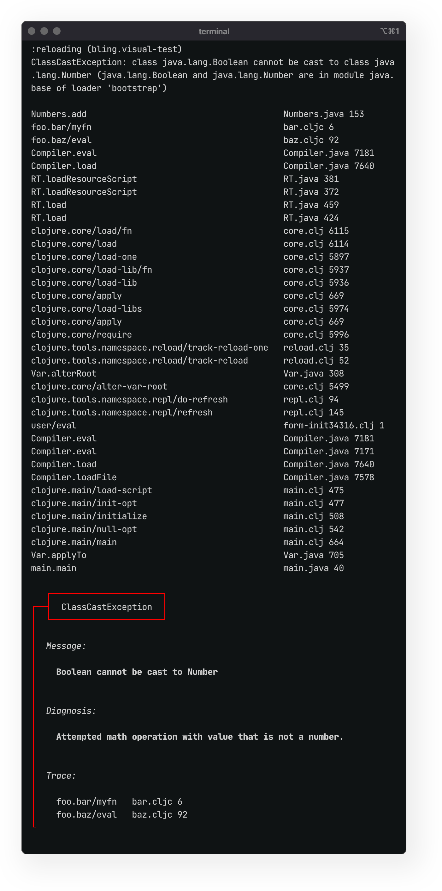
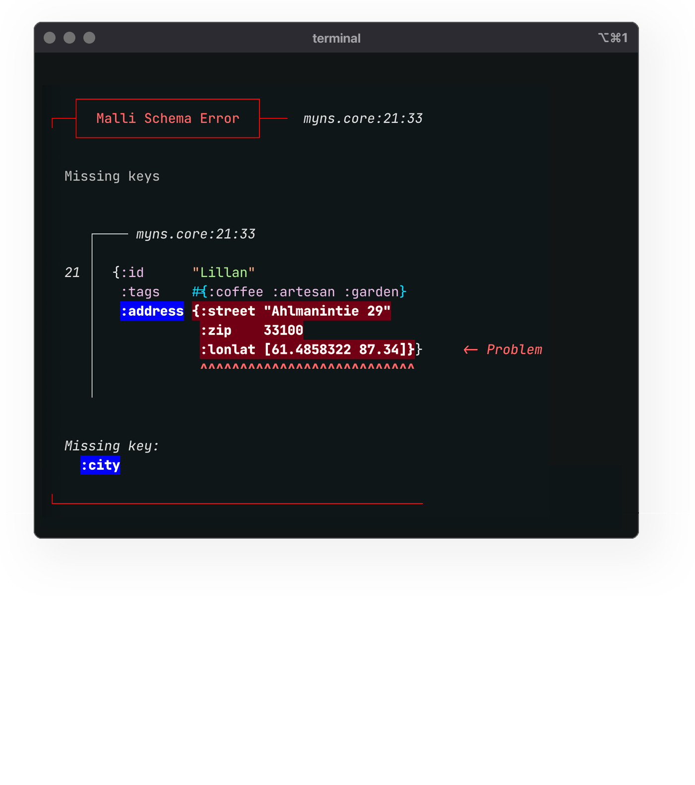
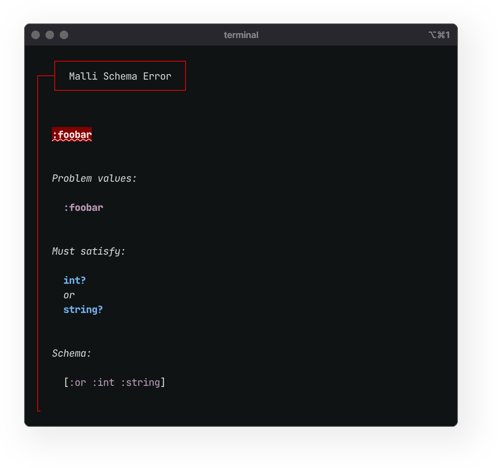

#### 2026 Roadmap
# Bling / Fireworks / Lasertag

<br>
<br>

## Project Growth

Thanks to the generous support from Clojurists Together for funding of Blind and Fireworks, I'm happy to report that a great deal of progress was made in 2025. Building on the momentum, I would love to continue to grow and improve the projects. As I got deeper into the work last year, it became clear that 2 of Bling's supporting libraries ([Fireworks](https://github.com/paintparty/fireworks) and [Lasertag](https://github.com/paintparty/lasertag), which I also authored) were part of a cohesive whole. To improve ergonomics of both the development and consumption, I plan to refactor some of the responsibilities of Fireworks (formatting and syntax coloring) into Bling.


<br>

## General Direction

***"Better error messages"*** has consistently topped the list of desired improvements to Clojure, according to the last 10 years of results from the annual [State of Clojure Survey](https://clojure.org/news/2024/12/02/state-of-clojure-2024). One of the initial goals of Bling was to provide an excellent starting point for rolling your own error messages. This has been a success - [`bling.core/callout`](https://github.com/paintparty/bling?tab=readme-ov-file#callout-blocks) offers Clojure developers a sensible, accessible, and flexible templating system. To promote the use of this feature, I recently created a dedicated UI to configure and preview these callout blocks, and generate snippets for use:

<a href="https://paintparty.github.io/bling" target="_blank">https://paintparty.github.io/bling</a>


More recently, specific [support for Malli](https://github.com/paintparty/bling?tab=readme-ov-file#usage-with-malli) validation errors was added by combining these callout functions with the newly-added [hi-fidelity](https://github.com/paintparty/bling?tab=readme-ov-file#high-fidelity-printing) printing capabilities. Going forward, Bling will add additional, opt-in functionality that will deliver the same succinct error presentation to any & all exceptions that occur when developing with Clojure.


<br>

## Primary goals for 2026

### Improved Clojure error messages
Early development is underway for an augmented printing method applicable to any exceptions in Clojure, ClojureScript, and Babashka. This method will be installable via calling a `bling.error/install!` in code or at the repl. This will print exceptions as normal (perhaps slightly better formatting), followed by a nice Bling error `callout` that neatly summarizes the exception and only displays a small number of user namespaces where the problem can be traced. This way, the developer will first see the succinct summary in a callout, and can quickly get an overview of the exception and its root location at a glance. In many cases, this will be enough to pinpoint the problem and avoid the time and eyestrain associated with looking at a standard Clojure error message. The full stack trace will also be there if the user wants to examine details. Ideas and approaches from recent efforts in the community may prove very helpful here, particularly the exception printer from [`clojure-plus`](https://jank-lang.org/blog/2025-03-28-error-reporting/) and the general error-reporting strategy featured in [`jank`](https://jank-lang.org/blog/2025-03-28-error-reporting/).


<div align="center"></div>

### Humanized printing for Malli validation errors

(SECOND PHASE COMPLETE)

I've continued to iterate and improve on `bling.explain/explain-malli`, a specialized template for Malli validation errors. The initial implementation of this was vastly improved in Q1 of 2026, (`v.0.10.0`), with support for disjunctions and concise reporting that goes beyond what Malli has traditionally offered out of the box with its own `humanize` feature. I would like to gather feedback from the community and continue towards the goal of making this the most pleasant way to get beautiful, actionable feedback from a runtime specification system.

<br> [#28](https://github.com/paintparty/bling/issues/28)
<br> [#44](https://github.com/paintparty/bling/issues/44) 
<br> <a href="https://github.com/paintparty/bling?tab=readme-ov-file#usage-with-malli" target="_blank">Docs</a>

<br>
<p align="center"><sub><b>Malli schema validation, missing key example</b></sub></p>
<div align="center"></div>

<br>

<p align="center"><sub><b>Malli schema validation, multiple problems / disjunction example</b></sub></p>
<div align="center"></div>


### Interactive documentation site 
(INITIAL PHASE COMPLETED)

[A standalone documentation site for Bling](https://paintparty.github.io/bling) was recently launced. It features a nice GUI that allows users to preview output and configure snippets for `bling.core/callout`, which is a public function in Bling that is designed for the easy creation of nicely formatted, easy-to-read message blocks. This site was fun to make and I would love to continue to develop it, based on what the community finds useful in terms of discovery and enhanced workflow.

Specifically I would like to create a UI to preview samples of hifi printing on different data, with stock Fireworks themes. This UI will also allow the user to easily create custom colorization themes.

Fireworks has a robust theming story, and recently dropped experimental support for granular syntax-color theming of regexes (to make them easier to read), in [`v0.20.0`](https://github.com/paintparty/fireworks/releases/tag/v0.20.0). I would like to rethink the implementation of the theming system for reasons of enhanced performance and better usability (easier authoring).  Also, this could be a great addition to the new interactive docs as mentioned in the previous goal. Across programming languages, the general story of a formalized approach for syntax coloring has always been weak, in my opinion. This might be an opportunity for the Clojure community to provide some thought leadership in the form of a compelling reference implementation.


### Improved hiccup support 
[(COMPLETED)](https://github.com/paintparty/bling/issues/54)

Refined support for using hiccup with `bling.core/bling` to style and format messages. This includes supporting a `[:p]` paragraph construct, `[:br]` for line breaks, and efficient support for nested styles. 

```Clojure
'(require bling.core :refer [print-bling])

(println "\n\n")
(print-bling [:p "First paragraph"]
             [:p [:bold
                  "Bold, "
                  [:italic "bold italic, "
                   [:red "bold italic red, "]]
                  "bold."]]
             "Last line")
```

The above code renders the following:

<div align="center"></div>


### Pipeline for cljs browser console printing
[(COMPLETED)](https://github.com/paintparty/fireworks/issues/87)

Bling works just fine for printing to a browser dev console. Post-processing ansi-tagged bling output for browser console printing, would, however, be a big improvement vs the current implementation. This would apply in terms of code simplicity, maintenance, and, most importantly, the user experience of authoring templates for messages. 
<br>


### Theming for hifi-printing
Fireworks has a robust theming story, and recently dropped experimental support for granular syntax-color theming of regexes (to make them easier to read), in `v0.20.0`. I would like to rethink the implementation of the theming system for reasons of enhanced performance and better usability (easier authoring).  Also, this could be a great addition to the new interactive docs as mentioned in the previous goal. Across programming languages, the general story of a formalized approach for syntax coloring has always been weak, in my opinion. This might be an opportunity for the Clojure community to provide some thought leadership in the form of a compelling reference implementation.


### VSCode and Emacs extension for Fireworks tapping macros
As part of my Q3 2025 Clojurists Together project, I created editor integrations for VSCode (Joyride) and Intellij (Cursive + REPL commands). Based on this experience, I would like to publish this functionality as a relatively simple VSCode extension, or contribution to Calva (if wanted). Additionally, I plan to use the recently refined functionality/api to inform an Emacs extension.


### Internal usage of Malli
Currently, both Bling and Fireworks use `clojure.spec.alpha` to validate the shape of args to macros, as well as the shape of data for `config.edn` (used to config hifi printing options). Expound is used to humanize validation errors. All of these specs will be converted to Malli and Bling's own `explain-malli` can be leveraged as a replacement for Expound.


### Migrate hi-fidelity printing responsibilities
For hifi printing, move Fireworks colorizing/formatting functionality into `bling.hifi` namespace, and make Bling a dependency of Fireworks. This way, Fireworks becomes solely focused on the ergonomics of the debugging macros, and Bling covers all things having to do with colorization and formatting.


### Continued improvement of Lasertag.
Lasertag underpins the loose “type category” system used by Bling and Fireworks, to determine what kind of value something is and how it should be colored. It was created out of necessity, and upon announcing it last year, I learned that several other projects in the Clojure ecosystem (kondo, scicloj/kindly, and splint) had developed similar (internal) tagging systems. The library recently got an important release (v0.12.0) with a massive perf upgrade. I believe I now possess a much better understanding of this problem space and I’m convinced that getting this lib right could be provide great value to other tool creators going forward, especially in light of the growing number of Clojure dialects. I am planning to engage other library authors to get feedback on the finer points of this kind of value categorization, as it would be beneficial to have something of a community consensus on this kind of naming.

<br>
<br>
<br>
<br>

## Secondary goals for 2026


### Documentation of interactive workflow. 
As part of my Q3 2025 Clojurists Together project, I documented and provided starter templates for a JVM Clojure-based hot-reloaded tap-driven development workflow, for both `lein` and `deps`. I would like to produce more content like this because I think people could get a lot of value out of it.


### Take Bling’s color system to the next level
Support arbitrary hex colors, and their conversion, if necessary, to x256. An efficient Manhattan distance algorithm for doing this conversion already exists in Fireworks.

Add additional opt-in environmental variables that Bling and Firework can leverage to optimize color, contrast, and chroma for the user, based on their preferences. I have some newer ideas about this that I don’t think have been tried anywhere else. Again, I think this could be an potential area for the Clojure community to provide broader thought leadership.


### Internal usage of Malli
Currently, both Bling and Fireworks use `clojure.spec.alpha` to validate the shape of args to macros, as well as the shape of data for `config.edn` (used to config hifi printing options). Expound is used to humanize validation errors. All of these specs will be converted to Malli and Bling's own `explain-malli` can be leveraged as a replacement for Expound.


### “Live Tapping” in VSCode
As part of aforementioned VSCode extension, I would like to take a stab at creating a LightTable-esque feature in VSCode. This would render inline results of values that are wrapped with Firework’s tapping macros. Functionality like this exists in mainstream JS (Quokka, Console Ninja), but you have to pay a yearly subscription for it. So it would be awesome if we could offer it for free, and could possibly help drive wider adoption of Clojure/Script.


### Browser extension
For ClojureScript developers using Fireworks in a browser dev console, A dedicated Chrome extension was made to enable the setting of the Chrome DevTools console background and foreground color with a very nice GUI interface. Would be cool to get this updated and also working in most other Chromium-based browsers, as well as Firefox.


  <br>

  ### Completed Secondary goals

  **The following secondary goals were completed in Q1:**

  - Allow for quick call-site changes to the label color for Fireworks output. [#53](https://github.com/paintparty/fireworks/issues/53) 

  - When hifi printing, properly display contents of JS Sets and Maps, when they are within a native cljs data structure. [#46](https://github.com/paintparty/fireworks/issues/46)  

  - For hifi printing, support call-site option to force single-column map layout a la carte. This is sometimes preferable when map contains keys or values that are long strings. [#45](https://github.com/paintparty/fireworks/issues/45)

  - Support a `:trace` mode with `fireworks.core/?` debugging macro. [#23](https://github.com/paintparty/fireworks/issues/23)

  - Create a stand-alone documentation site featuring an interactive UI to preview samples of hifi printing on different data, with stock Fireworks themes. This UI will also allow the user to easily create a custom colorization themes for hifi-printing


  - In Lasertag, add additional support for native Java and JavaScript types/classes.

  - Augment Lasertag test suite for extensive coverage of native types and classes across JVM and Clojure.

  - For ClojureScript developers using Fireworks in a browser dev console, A [dedicated Chrome extension](https://github.com/paintparty/fireworks?tab=readme-ov-file#setting-the-background-color-and-font-in-chrome-devtools-clojurescript) was made to enable the setting of the Chrome DevTools console background and foreground color with a very nice GUI interface. Would be cool to get updated and also working in most other Chromium-based browsers, and potentially Firefox.


