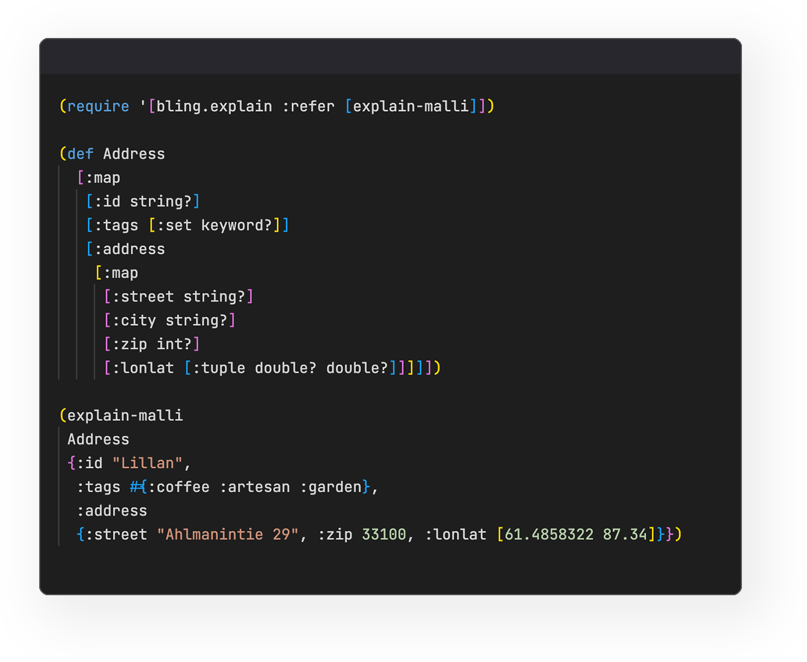
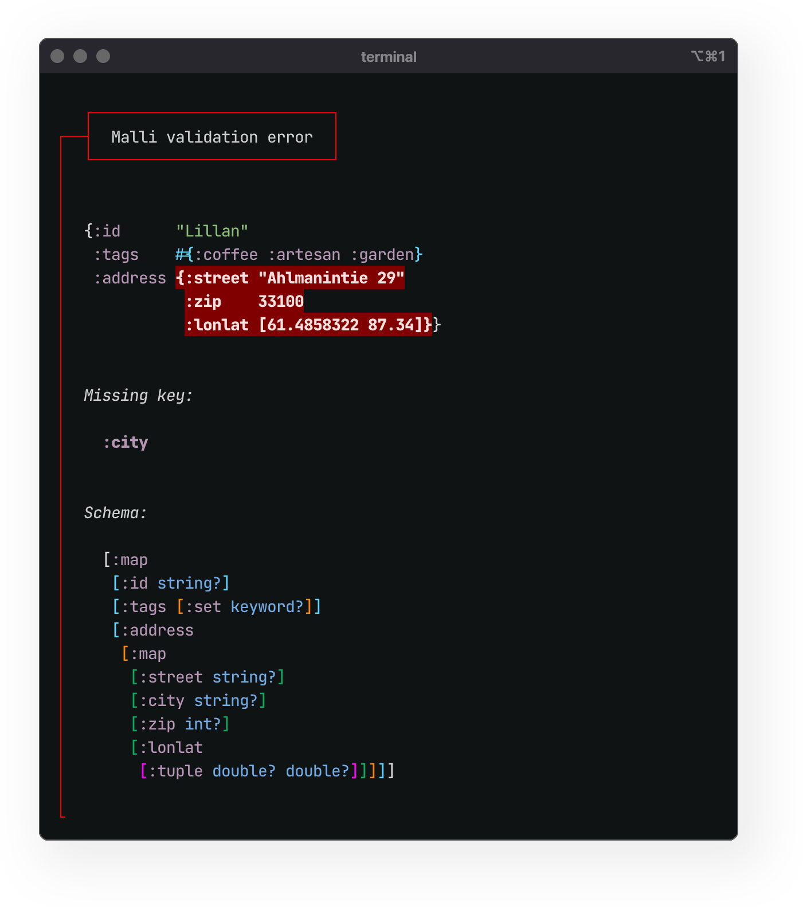
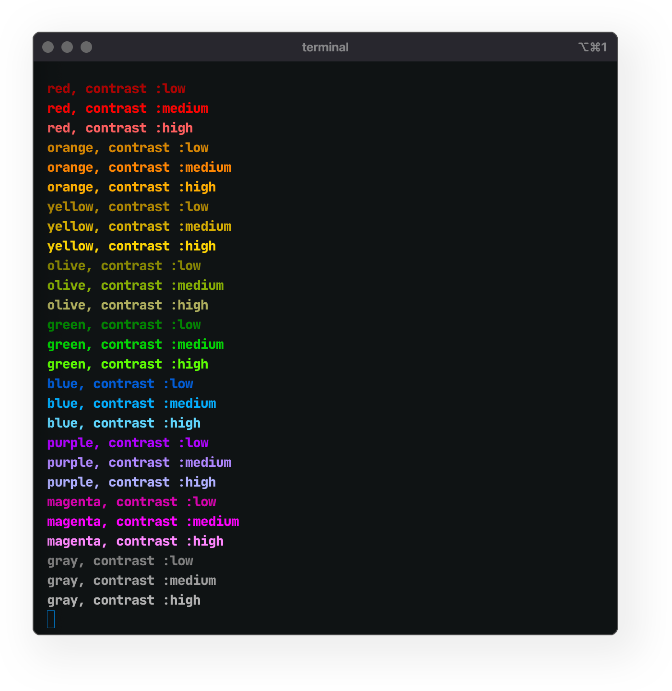
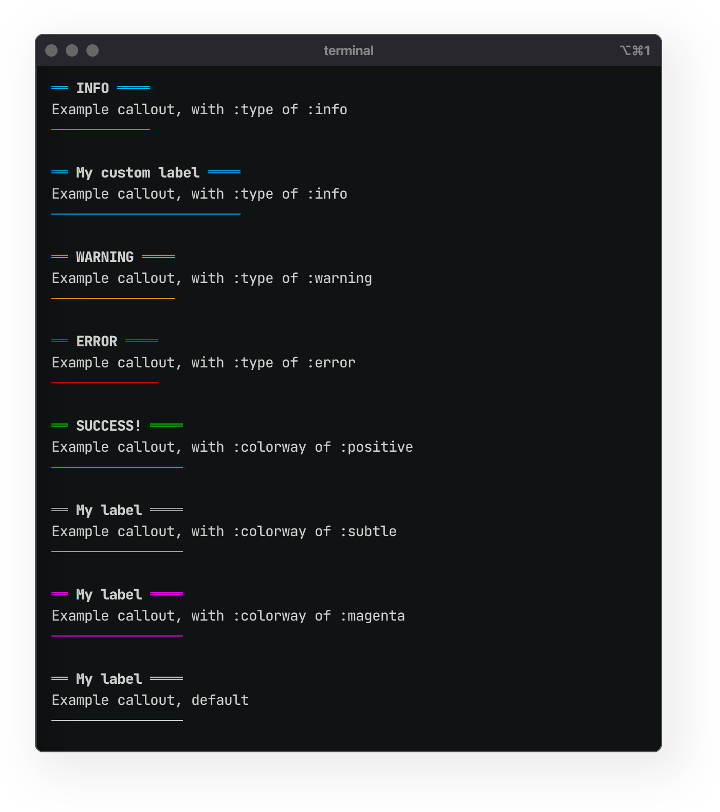
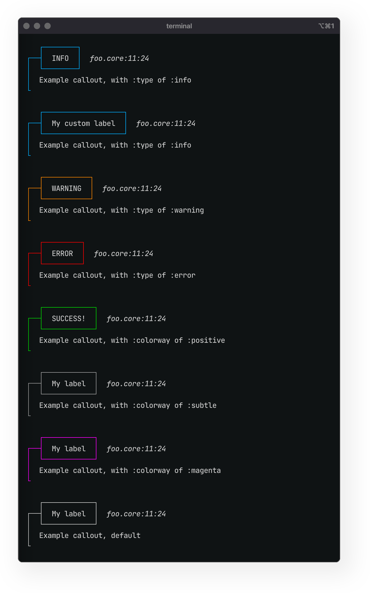

 ## Bling: Jeremiah Coyle

Q2 2025 Report No. 2, Published July 14, 2025

<br>

I'm happy to report that all of the Q2 primary and secondary goals were completed. In addition, some tertiary goals and user requests that popped up along the way were addressed. Many thanks to Clojurists Together for supporting this work!

<br>

Summary of goals achieved in Q2:

<br>

- **Primary goals**

  - Enable Hi-Fidelity, theme-able, colorized, structural printing of values via Fireworks. 
[#29](https://github.com/paintparty/bling/issues/29). [Docs](https://github.com/paintparty/bling?tab=readme-ov-file#high-fidelity-printing)
  - Utilize `callout` to create a specialized template for Malli validation errors. 
[#28](https://github.com/paintparty/bling/issues/28).  <a href="https://github.com/paintparty/bling?tab=readme-ov-file#usage-with-malli">Docs </a>
  - Figlet banners with lolcat-style gradient coloring. [Docs](https://github.com/paintparty/bling?tab=readme-ov-file#figlet-banners)
  - Opt-in optimization for enhanced contrast in light or dark terminals. [#30](https://github.com/paintparty/bling/issues/30). [Docs](https://github.com/paintparty/bling?tab=readme-ov-file#enhanced-contrast)
  - Respect `NO_COLOR` env var [#27](https://github.com/paintparty/bling/issues/27). [Docs](https://github.com/paintparty/bling?tab=readme-ov-file#respecting-the-users-preference-for-no-color)

<br>

- **Secondary goals**

  - Add enhanced support for using hiccup to style and format messages. [#15](https://github.com/paintparty/bling/issues/15)
  - Create 1-3 additional formatting templates for [callouts](https://github.com/paintparty/bling?tab=readme-ov-file#with-theme-minimal), [headers](https://github.com/paintparty/bling?tab=readme-ov-file#side-label), and points-of-interest.
  - Add/update [documentation](https://github.com/paintparty/bling?tab=readme-ov-file#templates-for-errors-and-warnings) about how to leverage Bling to create great-looking warnings and errors.

<br>

- **Tertiary goals that arose in the course of solving the above**

  - Enhanced test suite for JVM Clojure and Node (JS)
  - Enhanced test suite for Babashka
  - Hifi printing support for custom datatypes whose size cannot be determined [#69](https://github.com/paintparty/fireworks/issues/69)
  

<br>

The latest release is [`v0.8.7`](https://clojars.org/io.github.paintparty/bling/versions/0.8.7), which features most of the enhancements listed above.

<br>
<br>

Detailed descriptions and screenshots of the above features:

<h3>Specialized template for Malli validation errors</h3>

[#28](https://github.com/paintparty/bling/issues/28)

This is experimental, with more work to be done on optimizing for disjunctions and cases with multiple errors on same value. <a href="https://github.com/paintparty/bling?tab=readme-ov-file#usage-with-malli">Docs here</a>

Bling offers `bling.explain/explain-malli` to present [Malli](https://github.com/metosin/malli) validation errors:

<div align="center"></div>


<br>

The above code would print the following:

<div align="center"></div>


You can also pass an option trailing options map to customize the appearance of the printed output. In the example below, we are leaving out the display of the schema within the callout block:


<div align="center"></div>


<br>

The above code would print the following:

<div align="center"></div>

<h3>High Fidelity Printing</h3>

[#29](https://github.com/paintparty/bling/issues/29)

<a href="https://github.com/paintparty/bling?tab=readme-ov-file#high-fidelity-printing">Docs here</a>

Bling offers `bling.hifi` for colorized pretty-printing of values. `bling.hifi/hifi` will return an ansi-sgr decorated string, while `bling.hifi/print-hifi` will print such a string.

Under the hood, the formatting/colorizing is achieved with <a href="https://github.com/paintparty/fireworks" target="_blank">Fireworks</a>.

By default, the theme of this output will be `Universal Neutral`.

If you [set a valid `BLING_MOOD` env var](https://github.com/paintparty/bling?tab=readme-ov-file#enhanced-contrast), the theme of the `hifi` output will be `Alabaster Light` or `Alabaster Dark`. 

You can choose <a href="https://github.com/paintparty/fireworks?tab=readme-ov-file#theming" target="_blank">one of the other available themes</a> by following the instructions in the Fireworks readme and <a href="https://github.com/paintparty/fireworks?tab=readme-ov-file#step-3" target="_blank">setting up a `config.edn` on your system</a>, with a corresponding `BLING_CONFIG` env var. This config will also let you control many other aspects of the formatting with the `hifi` output.

Check out <a href="https://github.com/paintparty/fireworks?tab=readme-ov-file#theming" target="_blank">the other available themes here</a>


<br>

<div align="center"><sub><b><i>Alabaster Dark&nbsp;&nbsp;&nbsp;&nbsp;&nbsp;&nbsp;&nbsp;&nbsp;</i></b></sub></div>
<div align="center"></div>

<div align="center"><sub><b><i>Alabaster Light&nbsp;&nbsp;&nbsp;&nbsp;&nbsp;&nbsp;&nbsp;&nbsp;</i></b></sub></div>
<div align="center"></div>

<br>


<h3>Figlet banners:</h3>
<a href="https://github.com/paintparty/bling?tab=readme-ov-file#figlet-banners">Docs here</a>

<br>
<br>

Bling now features basic support for composing <a href="https://en.wikipedia.org/wiki/FIGlet" target="_blank">Figlet</a> ascii-art
banners with <a href="https://github.com/busyloop/lolcat" target="_blank">lolcat-like gradient overlays</a>. Bling ships with a
small handful of ported Figlet fonts. The glyph layout implementation is bare-bones and there is currently no support for standard figlet
smushing. Figlet banners only work in terminal context (JVM Clojure or Node.js ClojureScript).

<p align="center">
  
</p>

<br>


<h3>Enhanced contrast</h3>

[#30](https://github.com/paintparty/bling/issues/30)

Docs [here](https://github.com/paintparty/bling?tab=readme-ov-file#enhanced-contrast).

You can set a `BLING_MOOD` env var to enhance the contrast of Bling-formatted output. Only takes effect on your system, for your eyes only. 

<div align="center"></div>

<div align="center"></div>


<br>

### Respect `NO_COLOR` env var

[#27](https://github.com/paintparty/bling/issues/27)

You can set a `NO_COLOR="true"`env var, which will disable any colorization on from any output generated by Bling. The de-colorization only applies locally, for your eyes only. More info on the [informal standard](https://no-color.org/).

<div align="center"></div>

<div align="center"></div>


<br>

### Enhanced support for hiccup

[#15](https://github.com/paintparty/bling/issues/15)

Deeper hiccup support for a cleaner template syntax

- Utilize `[:br]`tags for line breaks
- Introduce a `[:p]`tag, to enclose logical paragraphs and automatically add trailing newlines.
- Properly support nesting of styles ala `[:bold "Bold, " [:italic "bold italic, "] [:red "bold red, "] "bold."]`


```Clojure
'(require bling.core :refer [print-bling])

(println "\n\n")
(print-bling [:p "First paragraph"]
             [:p [:bold
                  "Bold, "
                  [:italic "bold italic, "
                   [:red "bold italic red, "]]
                  "bold."]]
             "Last line")
```

The above code renders the following:

<div align="center"></div>


An initial working implementation of the above is complete on branch `0.9.0`. Next step will be to consider alternate implementations (perf), test, refine, then merge into main branch.


<br>

### New callout templates

Callout docs [here](https://github.com/paintparty/bling?tab=readme-ov-file#callout-blocks)

New callout template with `{:theme :minimal}`:

<div align="center"></div>

<div align="center"></div>

<br><br>
New option `:side-label` which may be useful for file info etc.

With `{:theme :sideline :label-theme :marquee :side-label "foo.core:11:24"}`: 

<div align="center"></div>

<br>
<br>

### Enhanced support & improved docs for creating custom and warning callouts

`bling.core/callout` now accepts any number of arguments, which makes the templatization a little more flexible:
```Clojure
(defn my-error-callout [{:keys [header body source]}]
  (callout {:type        :error
            :padding-top 1}
           header
           source
           body))

(my-error-callout
 {:header "Your header message goes here\n"
  :source (point-of-interest 
           {:type                  :error
            :file                  "example.ns.core"
            :line                  11
            :column                1
            :form                  '(+ foo baz)
            :text-decoration-index 2})
  :body   (str "The body of your template goes here.\n"
               "Second line of copy.\n"
               "Another line.")})
```

The above callout would render like this your terminal emulator: 


<div align="center"></div>

<div align="center"></div>

<br>
<br>

### Hifi printing support for custom datatypes
This was a bug fix + enhancement [#69](https://github.com/paintparty/fireworks/issues/69) in the upstream Fireworks lib, which enables the representation of custom datatypes when printing with `bling.hifi/hifi`


<br>

### Enhanced test suites
A new suite of tests for both JVM Clojure and [Babashka was added](https://github.com/paintparty/bling/commit/baf2f9685ea1d2b9ffb7fc55f86d59c0247ae5fc). Docs [here](https://github.com/paintparty/bling?tab=readme-ov-file#testing).
