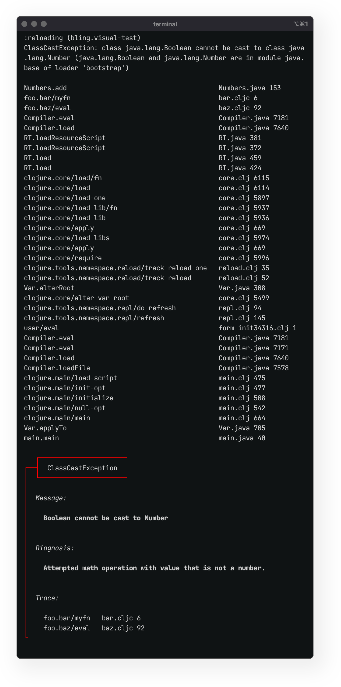
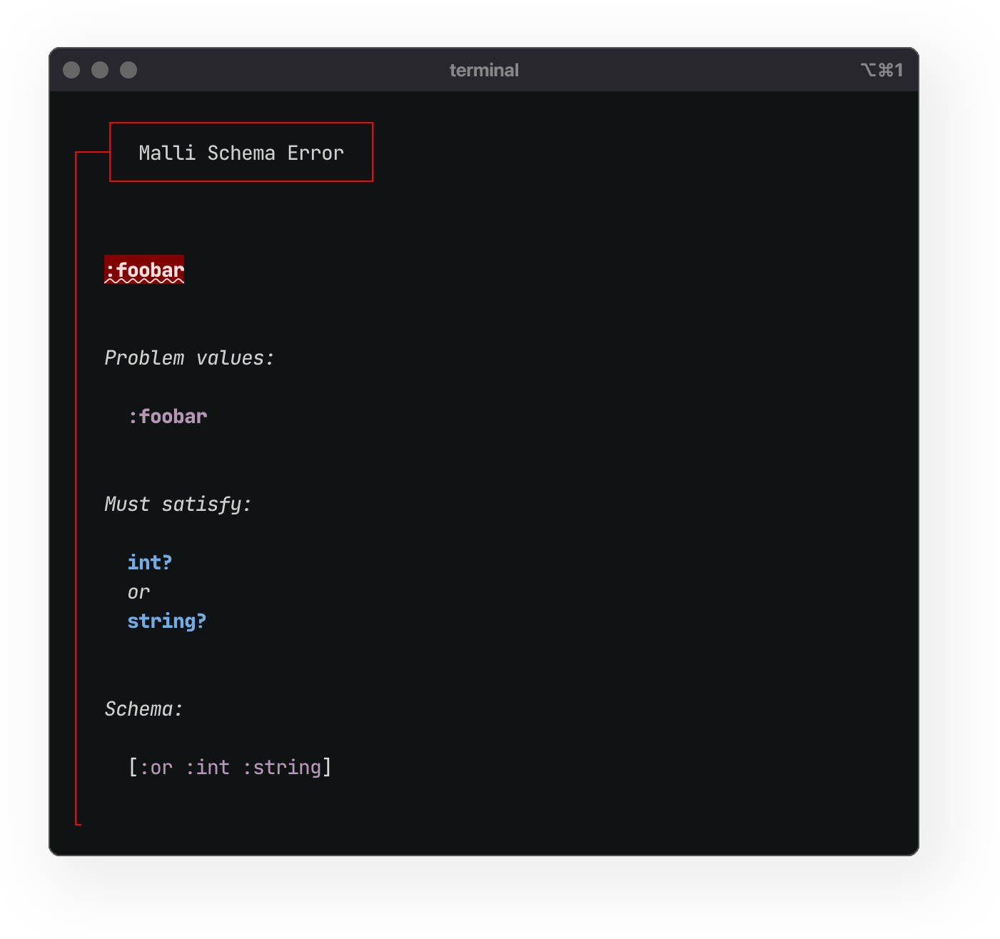

# Bling / Fireworks / Lasertag<br> Q3 Roadmap

<br>

This document is a brief overview of the development goals for Bling / Fireworks / Lasertag in Q3 2025.

[Bling](https://github.com/paintparty/bling) is library that enables rich console printing for Clojure, ClojureScript, and Babashka.

[Fireworks](https://github.com/paintparty/fireworks) features a hi-fidelity printing engine, leveraged by Bling to construct awesome error messages.

[Lasertag](https://github.com/paintparty/bling) is a focused utility library, used to tag values for themeable, colorized output.

<br>

## General Direction

"Better error messages" has consistently topped the list of desired improvements to Clojure, according to the last 10 years of results from the annual [State of Clojure Survey](https://clojure.org/news/2024/12/02/state-of-clojure-2024). One of the initial goals of Bling was to provide an excellent starting point for rolling your own error messages. This has been a success - [`bling.core/callout`](https://github.com/paintparty/bling?tab=readme-ov-file#callout-blocks) offers Clojure developers a sensible, accessible, and flexible template system. More recently, specific [support for Malli](https://github.com/paintparty/bling?tab=readme-ov-file#usage-with-malli) validation errors was added by leveraging said callout functions combined with the newly-added [hi-fidelity](https://github.com/paintparty/bling?tab=readme-ov-file#high-fidelity-printing) printing capabilities. Going forward, Bling will add additional, opt-in functionality that will deliver the same succinct error presentation to any & all exceptions that occur when developing with Clojure.


<br>

## Primary goals for Q3

### Improved Clojure error messages
Early development is underway for an augmented printing method applicable to any exceptions in Clojure, ClojureScript, and Babashka. This method will be installable via calling a `bling.error/install!` in code or at the repl. This will print exceptions as normal (perhaps slightly better formatting), followed by a nice Bling error `callout` that neatly summarizes the exception and only displays a small number of user namespaces where the problem can be traced. This way, the developer will first see the succinct summary in a callout, and can quickly get an overview of the exception and its root location at a glance. In many cases, this will be enough to pinpoint the problem and avoid the time and eyestrain associated with looking at a standard Clojure error message. The full stack trace will also be there if the user wants to examine details. Ideas and approaches from recent efforts in the community may prove very helpful here, particularly the exception printer from [`clojure-plus`](https://jank-lang.org/blog/2025-03-28-error-reporting/) and the general error-reporting strategy featured in [`jank`](https://jank-lang.org/blog/2025-03-28-error-reporting/).


<div align="center"></div>

### Humanized printing for Malli validation errors
Continue to iterate and improve on `bling.explain/explain-malli`, a specialized template for Malli validation errors. This work will focus on optimizing for disjunctions and cases with multiple errors on same value. 
<br>
[#28](https://github.com/paintparty/bling/issues/28)
<br>
[#44](https://github.com/paintparty/bling/issues/44) 
<br>
<a href="https://github.com/paintparty/bling?tab=readme-ov-file#usage-with-malli">Docs</a>


<br>
<p align="center"><sub><b>Malli schema validation, missing key example</b></sub></p>
<div align="center"></div>

<br>

<p align="center"><sub><b>Malli schema validation, multiple problems / disjunction example</b></sub></p>
<div align="center"></div>


### Improved hiccup support
Refine support for using hiccup with `bling.core/bling` to style and format messages. This includes supporting a `[:p]` paragraph construct, `[:br]` for line breaks, and efficient support for nested styles. A working POC has been fully implemented on feature branch [0.9.0](https://github.com/paintparty/bling/tree/0.9.0), with the intention of creating an additional, alternate implementation, then comparing the perf of the two approaches.
<br>
[#15](https://github.com/paintparty/bling/issues/15)

```Clojure
'(require bling.core :refer [print-bling])

(println "\n\n")
(print-bling [:p "First paragraph"]
             [:p [:bold
                  "Bold, "
                  [:italic "bold italic, "
                   [:red "bold italic red, "]]
                  "bold."]]
             "Last line")
```

The above code renders the following:

<div align="center"></div>


### Pipeline for cljs browser console printing
Bling works just fine for printing to a browser dev console. Post-processing ansi-tagged bling output for browser console printing, would, however, be a big improvement vs the current implementation. This would apply in terms of code simplicity, maintenance, and, most importantly, the user experience of authoring templates for messages. 
<br>
[#43](https://github.com/paintparty/bling/issues/41)


### Interactive documentation site
Create a stand-alone documentation site featuring an interactive wizard to quickly visualize the formatting, layout, and colorization of callouts for errors and warnings. This tool will also produce corresponding snippets of code for easy inclusion into user codebases.


### Internal usage of Malli
Currently, both Bling and Fireworks use `clojure.spec.alpha` to validate the shape of args to macros, as well as the shape of data for `config.edn` (used to config hifi printing options). Expound is used to humanize validation errors. All of these specs will be converted to Malli and Bling's own `explain-malli` can be leveraged as a replacement for Expound.


### Editor integration
For Fireworks, publish editor plugins/extensions/integrations for Emacs, VS Code, and IntelliJ. These are fairly simple extensions that just involve some basic form rewriting for wrapping/unwrapping forms. I've already created initial working versions locally for all the 3 editors listed above.


### Documentation of interactive workflow. 
Produce written and/or video documentation a live hot-reloading dev environment for JVM Clojure, powered by Fireworks and Bling, with versions for both Leiningen and Deps. I recently [merged a PR that that adds this to the library `test-refresh`](https://github.com/jakemcc/test-refresh/pull/91) . This sort of thing could also potentially be incorporated into other similar projects such as `metabase/hawk` and `tonsky/clj-reload`. I think this could have a potentially significant value for some newcomers to Clojure.


### Call-site options for quick formatting changes.
For hifi printing, support call-site option to disable all truncation and ellipsis
<br>
[#14](https://github.com/paintparty/fireworks/issues/14)

<br>
<br>
<br>
<br>

## Secondary goals

  - Move Fireworks colorizing/formatting functionality into the `bling/hifi/*`, and make Bling a dependency of Fireworks. This way, Fireworks becomes solely focused on the ergonomics of the debugging macros, and Bling covers all things having to do with colorization and formatting.

  - Allow for quick call-site changes to the label color for Fireworks output. [#53](https://github.com/paintparty/fireworks/issues/53)

  - When hifi printing, properly display contents of JS Sets and Maps, when they are within a native cljs data structure. [#46](https://github.com/paintparty/fireworks/issues/46)  

  - For hifi printing, support call-site option to force single-column map layout a la carte. This is sometimes preferable when map contains keys or values that are long strings. [#45](https://github.com/paintparty/fireworks/issues/45)

  - Support a `:trace` mode with `fireworks.core/?` debugging macro. [#23](https://github.com/paintparty/fireworks/issues/23)

  - Create a stand-alone documentation site featuring an interactive UI to preview samples of hifi printing on different data, with stock Fireworks themes. This UI will also allow the user to easily create a custom colorization themes for hifi-printing

  - Add support for automatic detection of the 3 levels of color support (16-color, 256-color, or Truecolor), using an approach similar to https://github.com/chalk/supports-color. [#42](https://github.com/paintparty/fireworks/issues/42)

  - Support arbitrary hex colors, and their conversion, if necessary, to x256. An efficient Manhattan distance algorithm for doing this conversion [already exists](https://github.com/paintparty/fireworks/blob/035ec4cb048db05f4cca3691f946931b3a87f624/src/fireworks/color.cljc#L26) in Fireworks  [#43](https://github.com/paintparty/fireworks/issues/43)

  - In Lasertag, add additional support for native Java and JavaScript types/classes.

  - Augment Lasertag test suite for extensive coverage of native types and classes across JVM and Clojure.

  - For ClojureScript developers using Fireworks in a browser dev console, A [dedicated Chrome extension](https://github.com/paintparty/fireworks?tab=readme-ov-file#setting-the-background-color-and-font-in-chrome-devtools-clojurescript) was made to enable the setting of the Chrome DevTools console background and foreground color with a very nice GUI interface. Would be cool to get updated and also working in most other Chromium-based browsers, and potentially Firefox.
